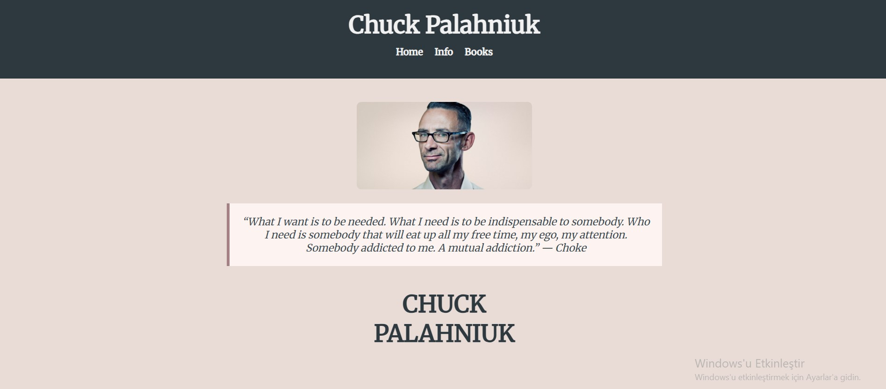
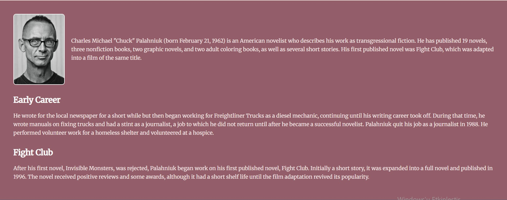
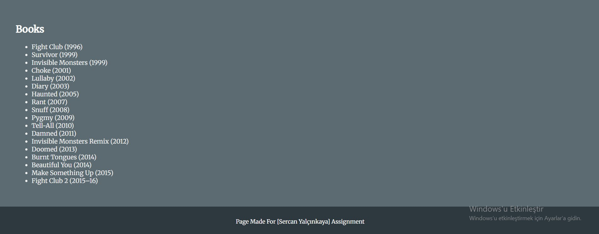

# Chuck Palahniuk Tanıtım Sitesi

Bu proje, **Chuck Palahniuk**'un hayatını, kariyerini ve kitaplarını tanıtmak amacıyla hazırlanmış basit bir HTML ve CSS projesidir. Ödev kapsamında geliştirilmiştir.

## 🎯 Özellikler

- HTML ve CSS ile sıfırdan tasarlanmış web sayfası
- Flexbox yapısıyla düzenli ve duyarlı (responsive) tasarım
- Alıntı kutusu ile öne çıkan sözler
- Biyografi bölümü ve görseller
- Kitap listesi (yıllarıyla birlikte)

## 📁 Proje Dosya Yapısı

chuck-palahniuk-site/
├── index.html
├── style.css
└── README.md

## 🖼️ Ekran Görüntüsü

## 🌐 Nasıl Görüntülenir?

Proje dosyasını bilgisayarınıza indirip `index.html` dosyasını bir tarayıcıda açarak görüntüleyebilirsiniz.

## 📚 Kullanılan Teknolojiler

- HTML5
- CSS3
- Google Fonts (Merriweather)

## 👨‍💻 Geliştirici

Bu sayfa **Sercan Yalçınkaya** tarafından bir ödev projesi olarak hazırlanmıştır.

---

